FIFA Overall Rating Predictor
================

Clear existing variables

``` r
rm(list = ls())
```

# Load in libraries and datasets

Load in Required Libraries

``` r
library(car)
library(ggplot2)
library(ggpubr)
library(scales)
library(Rmisc)
library(stringr)
library(corrplot)
library(caTools)
library(dplyr)
```

Load in datasets, filter correct game version, and select relevant
columns

``` r
fifa = read.csv('male_players (legacy).csv') %>%
  filter(fifa_version == 23 & fifa_update == 2) %>%
  select(short_name, overall, potential, club_name, height_cm, league_name, nationality_name,
         skill_moves, pace, defending, mentality_aggression, 
         mentality_interceptions, mentality_positioning, mentality_vision, mentality_penalties,
         mentality_composure, skill_ball_control, power_shot_power, power_long_shots,
         power_strength, power_stamina, power_jumping, wage_eur)

fifa2 = read.csv('player_data_full.csv') %>%
  select(short_name, positions, club_name)
```

# Data Wrangling

Merging datasets and cleaning up positions

``` r
# merging the two data frames on the common keys 
merged <- merge(x=fifa,y=fifa2, 
             by=c("short_name","club_name"))

# only keeping the first position
merged$positions <- gsub(",.*$", "", merged$positions)

# Replace RWB and LWB with RB and LB, respectively
merged$positions[merged$positions == "RWB"] <- "RB"
merged$positions[merged$positions == "LWB"] <- "LB"

# creating a linear combination because both were very highly correlated with each other
merged$growth <- merged$potential - merged$overall
```

Creating the dummy variables based on the EDA

``` r
# LEAGUES
merged$premier_league <- ifelse(merged$league_name == 'Premier League', 1, 0)
merged$la_liga <- ifelse(merged$league_name == 'La Liga', 1, 0)
merged$bundesliga <- ifelse(merged$league_name == 'Bundesliga', 1, 0)
merged$serieA <- ifelse(merged$league_name == 'Serie A', 1, 0)
merged$ligue1 <- ifelse(merged$league_name == 'Ligue 1', 1, 0)


# NATIONS
merged$portugal <- ifelse(merged$nationality_name == 'Portugal', 1, 0)
merged$argentina <- ifelse(merged$nationality_name == 'Argentina', 1, 0)
merged$italy <- ifelse(merged$nationality_name == 'Italy', 1, 0)
merged$spain <- ifelse(merged$nationality_name == 'Spain', 1, 0)
merged$brazil <- ifelse(merged$nationality_name == 'Brazil', 1, 0)


# POSITION
merged$cf <- ifelse(merged$positions == 'CF', 1, 0)


# SKILLS (4 & 5 STARS)

merged$four_skills <- ifelse(merged$skill_moves == 4, 1, 0)
merged$five_skills <- ifelse(merged$skill_moves == 5, 1, 0)
```

Creating Aggregate Variables for power, mentality

``` r
merged$total_power <- merged$power_shot_power + merged$power_long_shots + merged$power_strength +
  merged$power_stamina + merged$power_jumping

merged$total_mentality <- merged$mentality_aggression + merged$mentality_interceptions +
  merged$mentality_positioning + merged$mentality_vision + merged$mentality_penalties +
  merged$mentality_composure
```

Separate goalkeepers and fielders (two unique datasets)

``` r
keepers <- merged %>%
  filter(positions == 'GK') %>%
  subset(select = -c(pace, defending, cf, four_skills,
                     five_skills, skill_moves))

fielders <- merged %>%
  filter(positions != 'GK') %>%
  subset(select = -c( height_cm))
```

Identifying and removing the 2 field players with NA’s in their stats

``` r
nas <- fielders[!complete.cases(fielders), ]
fielders <- fielders[complete.cases(fielders), ]
```

Clean up goalkeeper data

``` r
keepers <- keepers %>%
  subset(keepers$total_mentality < 300)
```

# Fielders Exploratory Data Analysis (Descriptive Statistics)

Distribution of Response Variable (Overall)

``` r
ggplot(data = fielders, aes(x = (overall))) +
  geom_histogram(color = 'white', fill = 'light blue', bins = 20) + 
  labs(title = 'Distribution of Overall Rating', x = 'Overall Rating') +
  geom_vline(xintercept = mean(fielders$overall), color = 'red')
```

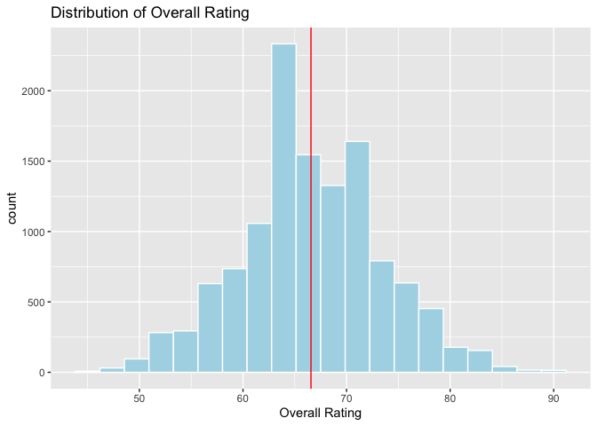<!-- -->

Examining the effects of different leagues

``` r
top_leagues <- c('Premier League', 'La Liga', 'Bundesliga', 'Ligue 1', 'Serie A')

# boxplot
fielders %>%
  filter(league_name %in% top_leagues) %>%  
  ggplot(aes(x = league_name, y = overall, fill = league_name)) +
  geom_boxplot() + 
  geom_hline(yintercept = median(fielders$overall), color = 'red') +
  labs(title = 'Overall Rating Across Leagues', x = "League Name", y = 'Overall Rating')
```

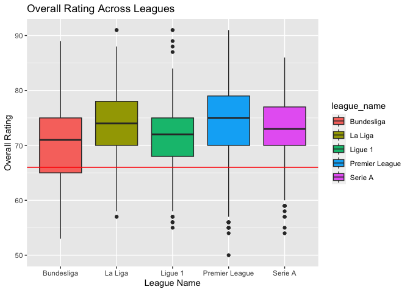<!-- -->

Average overall rating for the top nationalities

``` r
nations <- c('England', 'Brazil', 'Spain', 'France', 'Portugal', 'Argentina', 'Italy', 'Germany', 'Belgium')

fielders %>%
  filter(nationality_name %in% nations) %>%  
  ggplot(aes(x = nationality_name, y = overall, fill = nationality_name)) +
  geom_boxplot() + 
  geom_hline(yintercept = median(fielders$overall), color = 'red') +
  labs(title = "Overall Rating Across Nationalities", x = "Nationality", y = "Overall")
```

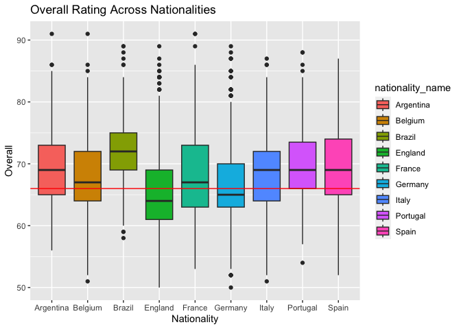<!-- -->

Creating a function to display all scatter plots at once for player
stats

``` r
stat_plots <- function(statistic) {
  ggplot(data = fielders, aes(x = statistic, y = overall)) + 
  geom_point(color = 'red', position = 'jitter', alpha = 0.1) +
  geom_smooth(method = 'lm') +
  stat_cor(method = "pearson")  
}

growth_plot <- stat_plots(fielders$growth) +
  labs(title = 'Overall Against Growth', x = 'Growth', y = 'Overall')

pace_plot <- stat_plots(fielders$pace) +
  labs(title = 'Overall Against Pace', x = 'Pace', y = 'Overall')

power_plot <- stat_plots(fielders$total_power) +
  labs(title = 'Overall Against Total Power', x = 'Total Power', y = 'Overall')

defending_plot <- stat_plots(fielders$defending) +
  labs(title = 'Overall Against Defending', x = 'Defending', y = 'Overall')

ball_control_plot <- stat_plots(fielders$skill_ball_control) +
  labs(title = 'Overall Against Ball Control', x = 'Ball Control', y = 'Overall')

multiplot(growth_plot, pace_plot, power_plot, defending_plot, ball_control_plot, cols = 2)
```

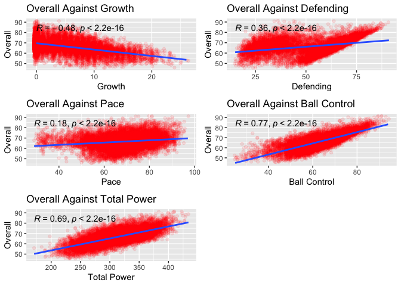<!-- -->

Correlation Heatmap of all relevant predictors in the dataset

``` r
cor_mat <- fielders %>%
  select(overall, defending, growth, pace, four_skills,
              total_power, skill_ball_control,
              premier_league, la_liga, bundesliga, ligue1, serieA,
              argentina, spain, italy, portugal, brazil,
              cf, five_skills, ligue1, wage_eur)

cor_mat <- round(cor(cor_mat), 2)

corrplot(cor_mat, method = 'color', type = 'lower', diag = F, tl.cex = 0.5, tl.col = 'black',
         tl.srt = 45)
```

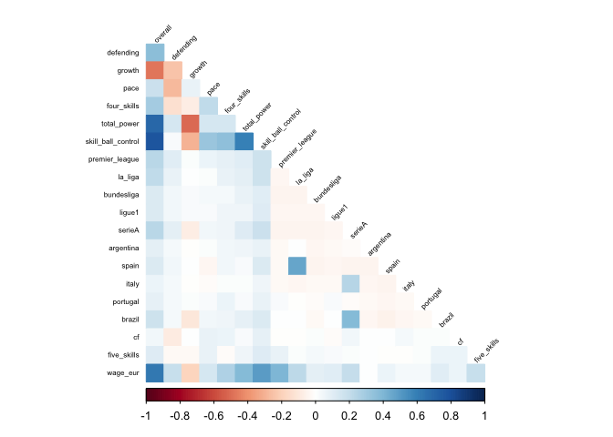<!-- -->

# Fielders Modeling

``` r
# Setting up the Train/Test Set
row.number <- sample(1:nrow(fielders), 0.8*nrow(fielders)) # returns random row numbers to be included in sample
train <- fielders[row.number,] # gives the actual data values for the previously recorded row numbers
test <- fielders[-row.number,] # gives the opposite from train


# Regression Model --> exclude wage bc it messes up predictions a ton
model <- lm((overall) ~ defending + pace + four_skills + 
              total_power + skill_ball_control +
              premier_league + la_liga + bundesliga + ligue1 + serieA +
              argentina  + spain + italy + portugal + brazil + 
              five_skills + ligue1 + growth + log(wage_eur),
              data = train)
summary(model)
```

    ## 
    ## Call:
    ## lm(formula = (overall) ~ defending + pace + four_skills + total_power + 
    ##     skill_ball_control + premier_league + la_liga + bundesliga + 
    ##     ligue1 + serieA + argentina + spain + italy + portugal + 
    ##     brazil + five_skills + ligue1 + growth + log(wage_eur), data = train)
    ## 
    ## Residuals:
    ##     Min      1Q  Median      3Q     Max 
    ## -9.8444 -1.6903 -0.0909  1.6356 12.0624 
    ## 
    ## Coefficients:
    ##                      Estimate Std. Error t value Pr(>|t|)    
    ## (Intercept)        21.1697221  0.3349711  63.199  < 2e-16 ***
    ## defending           0.0948817  0.0018612  50.979  < 2e-16 ***
    ## pace                0.0293578  0.0026773  10.965  < 2e-16 ***
    ## four_skills         1.6208213  0.1095876  14.790  < 2e-16 ***
    ## total_power         0.0303460  0.0009351  32.451  < 2e-16 ***
    ## skill_ball_control  0.2555599  0.0042528  60.092  < 2e-16 ***
    ## premier_league      1.6589399  0.1369265  12.116  < 2e-16 ***
    ## la_liga             1.3308046  0.1603988   8.297  < 2e-16 ***
    ## bundesliga          0.9633896  0.1295063   7.439 1.10e-13 ***
    ## ligue1              0.9919419  0.1608542   6.167 7.25e-10 ***
    ## serieA              0.7010288  0.1399082   5.011 5.52e-07 ***
    ## argentina           1.3379355  0.1367270   9.785  < 2e-16 ***
    ## spain               0.7568487  0.1229147   6.158 7.68e-10 ***
    ## italy               1.1822295  0.1466568   8.061 8.44e-16 ***
    ## portugal            1.2524649  0.1738528   7.204 6.27e-13 ***
    ## brazil              0.9815163  0.1441188   6.810 1.03e-11 ***
    ## five_skills         3.1055272  0.4666868   6.654 3.00e-11 ***
    ## growth             -0.1443840  0.0061390 -23.519  < 2e-16 ***
    ## log(wage_eur)       1.5365161  0.0301622  50.942  < 2e-16 ***
    ## ---
    ## Signif. codes:  0 '***' 0.001 '**' 0.01 '*' 0.05 '.' 0.1 ' ' 1
    ## 
    ## Residual standard error: 2.597 on 9791 degrees of freedom
    ## Multiple R-squared:  0.8549, Adjusted R-squared:  0.8547 
    ## F-statistic:  3205 on 18 and 9791 DF,  p-value: < 2.2e-16

``` r
# Checking VIF's for the predictors
vif(model)
```

    ##          defending               pace        four_skills        total_power 
    ##           1.302615           1.259245           1.208753           2.039459 
    ## skill_ball_control     premier_league            la_liga         bundesliga 
    ##           2.338670           1.193129           1.413998           1.112374 
    ##             ligue1             serieA          argentina              spain 
    ##           1.097285           1.454568           1.032541           1.329876 
    ##              italy           portugal             brazil        five_skills 
    ##           1.111416           1.023263           1.229152           1.029615 
    ##             growth      log(wage_eur) 
    ##           1.529421           2.484730

``` r
# Predicting the transfer values for the test set
prediction <- predict(model, newdata = test)
err <- (prediction) - test$overall


# REGRESSION DIAGNOSTICS
rmse <- sqrt(mean(err^2))
mae <- mean(abs(err))
mape <- mean(abs(err/test$overall))
c(RMSE = rmse, MAPE = mape, MAE = mae, R2 = summary(model)$r.squared)
```

    ##       RMSE       MAPE        MAE         R2 
    ## 2.66085342 0.03205593 2.09255262 0.85491830

``` r
# residual plot
res <- resid(model)
plot(fitted(model), res)
```

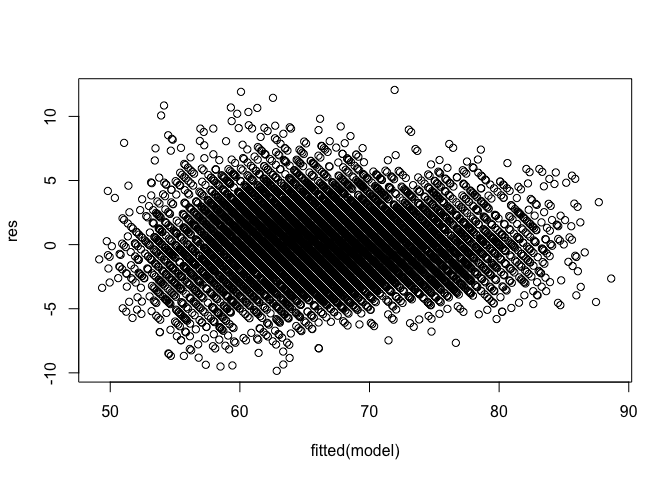<!-- -->

# Keepers Exploratory Data Analysis (Descriptive Statistics)

Distribution of Value for Goalkeepers

``` r
ggplot(data = keepers, aes(x = overall)) +
  geom_histogram(color = 'white', fill = 'light blue', bins = 20) + 
  labs(title = 'Distribution of Overall For Goalkeepers', x = 'Overall') +
  geom_vline(xintercept = mean(keepers$overall), color = 'blue')
```

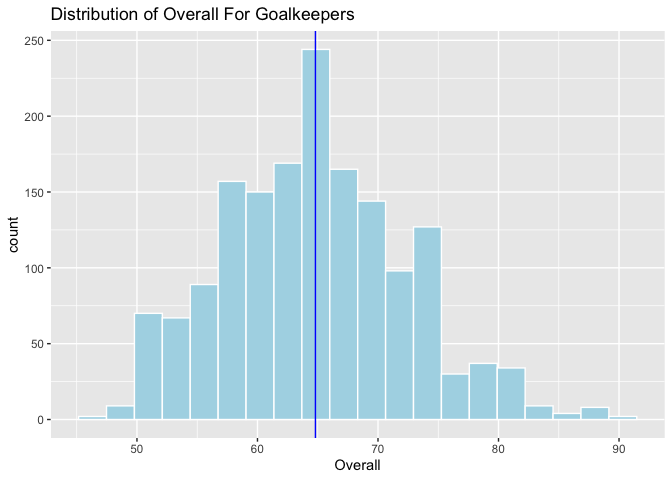<!-- -->

Keeper overalls across leagues

``` r
keepers %>%
  filter(league_name %in% top_leagues) %>%  
  ggplot(aes(x = league_name, y = overall, fill = league_name)) +
  geom_boxplot() + 
  geom_hline(yintercept = median(keepers$overall), color = 'red') +
  labs(title = 'Keepers Overalls Across Leagues', x = 'League Name', y = 'Overall')
```

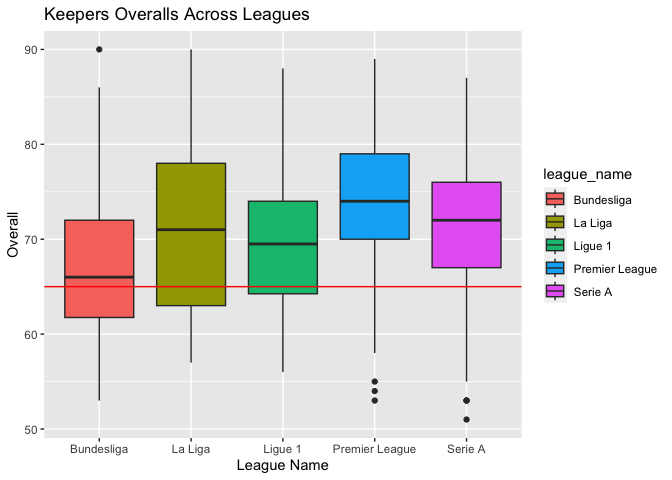<!-- -->

Keepers Across Nations

``` r
keepers %>%
  filter(nationality_name %in% nations) %>%  
  ggplot(aes(x = nationality_name, y = overall, fill = nationality_name)) +
  geom_boxplot() + 
  geom_hline(yintercept = median(keepers$overall), color = 'red') +
  labs(title = 'Keepers Overalls Across Nationalities', x = 'Nationality', y = 'Overall')
```

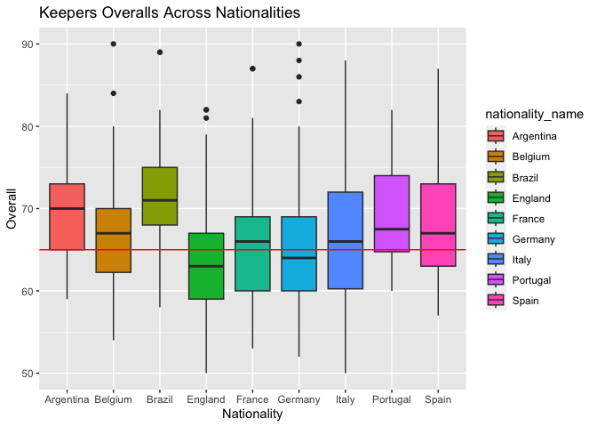<!-- -->

Goalkeeper Scatterplots

``` r
keeper_plots <- function(statistic) {
  ggplot(data = keepers, aes(x = statistic, y = overall)) + 
  geom_point(color = 'blue', position = 'jitter', alpha = 0.1) +
  geom_smooth(method = 'lm', color = 'coral') +
  stat_cor(method = "pearson")    
}

growth_plot_keepers <- keeper_plots(keepers$growth) +
  labs(title = 'Overall Against Growth', x = 'Growth', y = 'Overall')

mentality_plot_keepers <- keeper_plots(keepers$total_mentality) + 
  labs(title = 'Overall Against Total Mentality', x = 'Total Mentality', y = 'Overall')

height_plot <- keeper_plots(keepers$height_cm) +
  labs(title = 'Overall Against Height', x = 'Height', y = 'Overall')

power_plot_keepers <- keeper_plots(keepers$total_power) +
  labs(title = 'Overall Against Total Power', x = 'Total Power', y = 'Overall')

multiplot(growth_plot_keepers, mentality_plot_keepers, height_plot, power_plot_keepers, cols = 2)
```

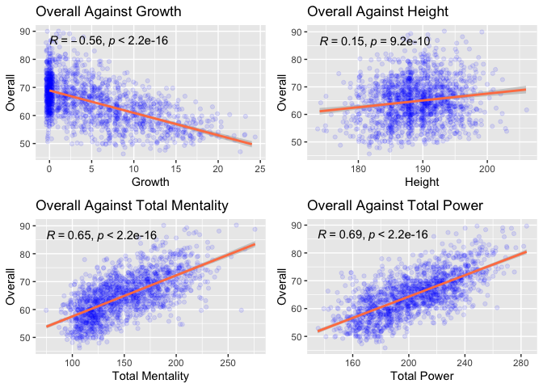<!-- -->

Keepers Correlation Heatmap

``` r
keepers_cor_mat <- keepers %>%
  select(overall, growth, la_liga, premier_league, ligue1, serieA,
            brazil, argentina, portugal, total_mentality, total_power, height_cm)

cor_mat_keepers <- round(cor(keepers_cor_mat), 2)

corrplot(cor_mat_keepers, method = 'shade', type = 'lower', diag = F, tl.cex = 1, tl.col = 'black',
         tl.srt = 45)
```

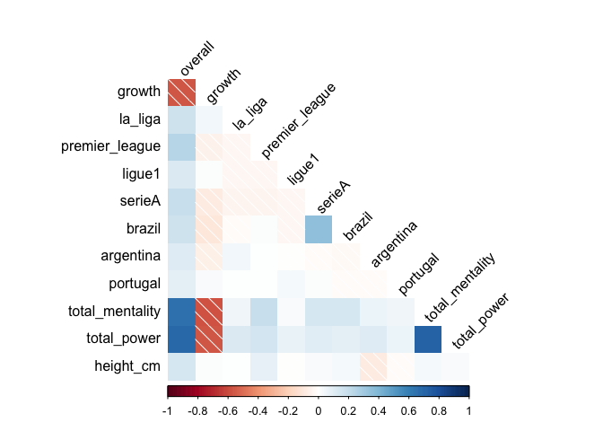<!-- -->

### Keeper Modeling

``` r
# Multiple Linear Regression Model
keeper_model <- lm(data = keepers, overall ~ growth + la_liga + premier_league + ligue1 + serieA +
                     brazil + argentina + portugal + total_mentality + total_power + height_cm)
summary(keeper_model)
```

    ## 
    ## Call:
    ## lm(formula = overall ~ growth + la_liga + premier_league + ligue1 + 
    ##     serieA + brazil + argentina + portugal + total_mentality + 
    ##     total_power + height_cm, data = keepers)
    ## 
    ## Residuals:
    ##      Min       1Q   Median       3Q      Max 
    ## -13.4176  -3.0854  -0.1648   3.1847  14.1516 
    ## 
    ## Coefficients:
    ##                  Estimate Std. Error t value Pr(>|t|)    
    ## (Intercept)     -1.373788   4.852778  -0.283 0.777142    
    ## growth          -0.341789   0.028213 -12.115  < 2e-16 ***
    ## la_liga          5.513364   0.599338   9.199  < 2e-16 ***
    ## premier_league   5.121234   0.600184   8.533  < 2e-16 ***
    ## ligue1           4.501133   0.633402   7.106 1.79e-12 ***
    ## serieA           3.462116   0.572924   6.043 1.88e-09 ***
    ## brazil           2.281447   0.689651   3.308 0.000960 ***
    ## argentina        2.595784   0.688012   3.773 0.000167 ***
    ## portugal         3.813225   0.899073   4.241 2.35e-05 ***
    ## total_mentality  0.045961   0.005329   8.624  < 2e-16 ***
    ## total_power      0.092051   0.006529  14.100  < 2e-16 ***
    ## height_cm        0.219199   0.025116   8.727  < 2e-16 ***
    ## ---
    ## Signif. codes:  0 '***' 0.001 '**' 0.01 '*' 0.05 '.' 0.1 ' ' 1
    ## 
    ## Residual standard error: 4.685 on 1603 degrees of freedom
    ## Multiple R-squared:  0.6247, Adjusted R-squared:  0.6222 
    ## F-statistic: 242.6 on 11 and 1603 DF,  p-value: < 2.2e-16

``` r
vif(keeper_model)
```

    ##          growth         la_liga  premier_league          ligue1          serieA 
    ##        1.690202        1.051141        1.069153        1.022227        1.164186 
    ##          brazil       argentina        portugal total_mentality     total_power 
    ##        1.151380        1.024829        1.013438        2.367439        2.340152 
    ##       height_cm 
    ##        1.016832

``` r
# Train and Test Set for Keepers
row.number2 <- sample(1:nrow(keepers), 0.8*nrow(keepers)) # returns random row numbers to be included in sample
train2 <- keepers[row.number2,] # gives the actual data values for the previously recorded row numbers
test2 <- keepers[-row.number2,] # gives the opposite from train

# Predicting the transfer values for the test set
prediction2 <- predict(keeper_model, newdata = test2)
err2 <- (prediction2) - test2$overall

# REGRESSION DIAGNOSTICS
keeper_rmse <- sqrt(mean(err2^2))
keeper_mae <- mean(abs(err2))
keeper_mape <- mean(abs(err2/test2$overall))
c(RMSE = keeper_rmse, MAPE = keeper_mape, MAE = keeper_mae, R2 = summary(keeper_model)$r.squared)
```

    ##       RMSE       MAPE        MAE         R2 
    ## 4.73644058 0.05882812 3.76533512 0.62472809

``` r
# residual plot
res2 <- resid(keeper_model)
plot(fitted(keeper_model), res2)
```

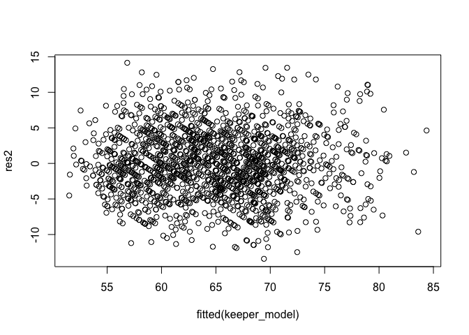<!-- -->
